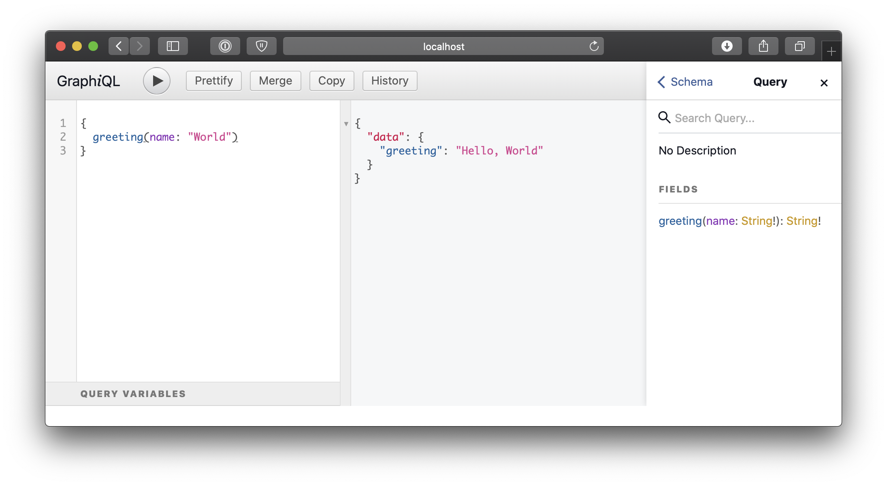

# GraphZahl (Alpha)

Create the best GraphQL APIs ever using Swift. GraphZahl is a Swift Framework that let's you write your Server the simplest way possible! With a magic, Codable-like API.

Here are the main reasons, why you could like it:

- 📝 Declarative
- 💡Intuitive 
- 📦 Compositable and extendable
- 🔐 Type-Safety
- 🕓 ZERO Boilerplate
- 😍 Familiar Codable-like Feel
- 🤪 Amazing for Quick Prototyping

## TL;DR?

Let's cut the chase and write our Hello World! 

```swift
// Create a GraphQLSchema
enum HelloWorld: GraphQLSchema {
    
    // Describe the Query Type 
    class Query: QueryType {
        func greeting(name: String) -> String {
            return "Hello, \(name)"
        }
    }

    typealias Mutation = None
}

// Run a query using .perform
let result = HelloWorld.perform(request: "...")
```

And you can even connect it to GraphiQL and test it:



**Let's break that down!**

Every GraphQL API begins with a root Schema where you define the Query Type and Mutation Type:

- Query Type (Mandatory): Describes all the read operations that can be done
- Mutation Type (Optional): Descripes all the write operations

For now we'll focus on the Query Type. 
GraphZahl will now look at any properties and functions that can be served in GraphQL, and will offer those as fields in your API.

In our example this means that it will find the function `greeting` and see that all the inputs and outputs are availanle as GraphQL Types and register it. Super easy 😍!

## Installation
### Swift Package Manager

You can install GraphZahl via [Swift Package Manager](https://swift.org/package-manager/) by adding the following line to your `Package.swift`:

```swift
import PackageDescription

let package = Package(
    [...]
    dependencies: [
        .Package(url: "https://github.com/nerdsupremacist/GraphZahl.git", majorVersion: XYZ)
    ]
)
```

## Usage

Most users of GraphZahl need to understand the four main provided protocols:

- `GraphQLObject`:  A type that is composed from multiple properties and functions
- `GraphQLSchema`:  The root of any API
- `GraphQLScalar`:  A singular value
- `GraphQLEnum`: An simple enum that is RawRepresentable with String (so no associated values, sadly)

### GraphQLObject

You can provide any class you want by simply making it implement  `GraphQLObject`. And voila!!!! 😍
You don't have to implement anything. GraphZahl will do all the magic for you:

- Every property that is either:
    a. a GraphQL Object, 
    a. Scalar 
    a. or Enum

will be available via GraphQL. Zero hassle. Crazy!!!

- Every method where:
    a. every input is a Scalar or Enum
    a. the return type is either:
        a. a GraphQL Object, 
        a. Scalar 
        a. or Enum

is now also available! Just like that. Awesome!!!

**Let's try it:**

We define our class. With some properties and methods:

```swift
class MyObject: GraphQLObject {
    let greeting = "Hello World!"
    let favouriteNumber = 42

    func count(to number: Int) -> String {
        return (0..<number).map(String.init).joined(separator: ", ")
    }
}
```

And we can see it appear in our API:


*- left: a query for the data of MyObject*
*- middle: the returned json from our API*
*- right: the type definition of MyObject*

### GraphQLSchema

A Schema 

## Contributions
Contributions are welcome and encouraged!

## Learn
This is currenlty a research project. More details about how it works, will be published later.

## License
GraphZahl is available under the MIT license. See the LICENSE file for more info.

This project is being done under the supervision of the Chair for Applied Software Enginnering at the Technical University of Munich. The chair has everlasting rights to use and maintain this tool.
